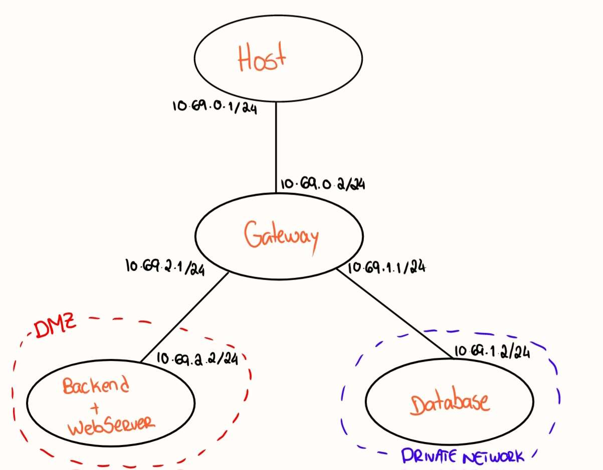

# A39 BlingBank Project Report

## 1. Introduction

BlingBank provides an online banking platform, accessible via a web application.
The main functionalities are: account management, expense monitoring, and payments. The account management allows an efficient oversight of account balance. Expense monitoring shows the movements corresponding to expenses, in categories. Finally, payments allow a simple way to make bill payments.

### 1.1. Secure Documents
Our secure documents must ensure authenticity and confidentiality of the account data. Therefore, these properties are achieved by a custom library which will be explained in more detail in the following sections.

### 1.2. Infrastructure
BlingBank's infrastructure is composed of four servers: a gateway, a web server, a backend server and a database server.

### 1.3. Security Challenge
The security challenge consists of a new requirement: a new document format specifically for payment orders which must guarantee confidentiality, authenticity, and non-repudiation of each transaction. Additionally, accounts with mulitple owners require authorization and non-repudiation from all owners before the payment order is executed.

### 1.4 Project Structure
Our BlingBank project has the following structure that will be explained in more detail in the following sections.


## 2. Project Development

### 2.1. Secure Document Format

#### 2.1.1. Design

BlingBank's cryptographic custom library needs to protect, check, and unprotect documents. The protection of a document is done in such way that it ensures confidentiality, integrity and authenticity. In order to achieve this the following structure was created.

##### Confidentiality

It was used AES (Advanced Encryption Standard) with a 256-bit key in CBC (Cipher Block Chaining) mode.
In order to use CBC mode, an IV (Initialization Vector) is needed.
AES-256 is considered to be secure by the NIST (National Institute of Standards and Technology), therefore it was chosen.
CBC mode is more secure than ECB (Electronic Code Book) mode, due to the fact that if there are two blocks with the same content, they will not be encrypted to the same value.

##### Integrity

The Library can accept either an HMAC (Hash-based Message Authentication Code) or a DS (Digital Signature).

The HMAC uses SHA-256 as the hash function.
In order to use HMAC, a key is needed.
The length of the key is equal to the length of the hash function (256 bits), which is considered to be secure by the NIST.

The DS uses ECDSA (Elliptic Curve Digital Signature Algorithm) with the p521 curve.
p521 is considered to be secure by the NIST, therefore it was chosen.
In order to use a DS, a private key is needed.

##### Authenticity

Authenticity is achieved by using the also the HMAC or the DS.
With the HMAC, the document can be verified by the receiver, ensuring authenticity.

###### Non-Repudiation

By using a DS, the document can be signed with a private key and then verified with the corresponding public key.
This way, the document can be verified by anyone that has public key, ensuring non-repudiation.

###### Replay Attacks

By itself, the Library does not protect against replay attacks.
This is done by design. The Library is meant to be stateless, so it does not keep track of the documents that were already processed.
It is up to the user of the Library to keep track of the documents that were already processed.
This issue was discussed with the professor and it was agreed that this was not a issue as long as the verification is done by the third party using the library.
It was discussed that the CLI tool does not need to protect against replay attacks.
In the case of the backend, this implementation is done by the backend itself.

###### Freshness

The Library also has the ability to check the freshness of the document.
While protecting, it can generate a nonce based on the current time or accept a custom nonce.
While unprotecting/checking, a custom nonce verification function can be used.
Allowing for modularity and flexibility.
It was also discussed with the professor if the CLI should verify the freshness of the document. It was not required, but in the backend it was implemented.

##### Document Structure

With all the properties mentioned above, we can now define how the library will protect the documents.

Starting by the "outside" layer, we can get two parts: the IV and the protected data.

Since the IV is not sensitive data, it can be sent in plain text and it can be easily extracted from the protected data, since it has always the same length (16 bytes).

The protected data is encrypted with the AES key and using the IV.

The data is divided into seven parts:
- The first part is the content length.
- The second part is the content itself.
- The third part is the nonce length.
- The fourth part is the nonce itself.
- The fifth part is the HMAC or the DS length.
- The sixth part is the HMAC or the DS itself.

The HMAC or DS is calculated over the content and the nonce.


Note: The protected data is encoded to base64 in order to be sent as a string,
since JSON does not support raw bytes.

<details>
<summary>Comparasion of unprotected and protected file</summary>

<details>
<summary> Unprotected file </summary>

```json
{
    "account": {
      "accountHolder": [
        "Alice"
      ],
      "balance": 872.22,
      "currency": "EUR",
      "movements": [
        {
          "date": "09/11/2023",
          "value": 1000,
          "description": "Salary"
        },
        {
          "date": "15/11/2023",
          "value": -77.78,
          "description": "Electricity bill"
        },
        {
          "date": "22/11/2023",
          "value": -50,
          "description": "ATM Withdrawal"
        }
      ]
    }
}
```
</details>

<details>
<summary> Protected file </summary>

```json
{
  "account": {
    "accountHolder": [
      "JphVj5rENm+JTNODC2A+qKqRI2oOMtesmLVOSM0lyOn7u8TgX8DzJes2eqB+XKwwDE/0KLGUQKf3SmQxcD4KbG1wSWDYy6t3Wa+cuZOeyzaXK877/YKQjM2mCA5UICFb0mjmaUJif3i6lW8NTtBvyQJJIk97ytfBCDQ4QDq5SOCTXl1k7/qOhLgtbP6CRDCX+86PME0be4J0WKYGxEh7UiSEto4EpJPZNl+vgKWM8z/vvVsly4OMuzgKFe+D9TRA"
    ],
    "balance": "A7RCdYBUpmP8WfgHy7isAAB9ekIyX2VR5bs+MyhhCFoXQL9w07oLyk62dFR1EVqy2xT5Z6QhzeOuPTAJCHT9UySRYTqb5eMnPJAnOkB43z2oZsNaG4PbWKlIRwgmx/DQn0FbgTve3OYRogZwqmB/pZ7V1NG4Q5D77mM8bJ7R8f7AtQG41pQzA3yca3wUnnr+nSKPL4IkHFtgo/Juw2i/i45/2GPzne6IPvaD6ttjI5WKcJZj9tACe9Dc0s5Rq01R",
    "currency": "7v6VZfTPexleY7tQdpwX9qwe9qY4mPJLNsJ/OQZzFNncmwDUwuDkgHRuEp+rDFpFbuI/2s6TiVB3NoXutS7o+DLqb0/ob+kXj+QiGIRR9xd3R2uK/R7XCljGg8ff2ieULUWOgZfsrCIcIJuHOqVJnBpZB6LVuw6J9hjZ4b6vE0J20ccgQpuDngBcThG3sipY35fz2A9+4iYd8u2juwiaSYELl0uolQ2MXHiZVX5EmZ8yrBxhNb1Y1z7fGcoqnzJE",
    "movements": [
      {
        "date": "q9GufmJMsGCKWsTzxIstiYY0IY6w8eaI2Jdhjzj8182L1R1BuBwg5jbrnq1j1/L5ajQR7dmPUrm3zFVQE+o42UjChKwwB13mkZyfDcvjUuGJhlZFV2Its42znu0a/RoxlSAwEUvLTIJB+77LFZwoMCmsv7gzNXOWSLQ9ebxva/pDa6SHbVaLS5/HdIb3Fg3kTnXJ8Tfe2EjkpabNvWcfywvAQ0Xoa1NMoyaU2h+oRf/dYNk1/9aEf0WCXyzwhegn",
        "value": "zkYnI2CUmJorG0UKv42T10UyZ3zojAUklPJEZc/VDJXkIODyc6rNL/PQq41c7vLj3TyZW5EhZVy+FD135ZhrvMs2WW/OIwW3o7tAU9eSIb9RB3YqFrEqeS+d9ghdumVxlkvb0XiM7IGjmRGnsYWRCvgdgryQqzSeNdDllEceLwGSeQxHPnunrOb5SpT3I7HceCNEu3yjG4SD65WKfIfgJWaA+nNivKzAmC+j6u4kG16u+10P1KVDIMoiIvOpc/E2",
        "description": "ZMpRkOUTPkB3o26pFgUWtMc3ENjAIX3by1eh2Y8tMgo0N10eDilTVPtWOrNRYXYX7H/0iDze0icX9qe/g0CMKpMM6PFMX446sLndQNeaCZJcp0nC6fFhPO7J1eXmdFVoCsWVggZpngdNgxkfI8xlog90PTsbMN3434ozkq5QfXkhgIt+vfDBWV3t3oZopebYlzHnyZhmHBFJStpeCLafaufwOqWCwCaP0CLFt7iBMax/wmpe33adLgM5y9NSs37w"
      },
      {
        "date": "rs2CFcoRggnxZOLHzMpTRVz85/zlBDianMF1qRT7BsioDFOuGJ86uN2jfxd7yEcdoNvpqOtAFzhxtFwFGCaqiY1wGI9p16CDyk4jFHt8ONz4amKh2aZ5Gv0jbuimoV7kzuVSP0YUZX3nDaUcE1XZdatfFNVLeUIeb5Rgr3zJeGLUltvZe07aukwF5Nbjpe7y5thXYE+i3n9D2HNtaqiw/HORtYKdtzHlj4jrdvN9+nh96YoZkN+MEL1jwyYemRKM",
        "value": "3Vd5EFNvm1y6dkDeoF8xS/YMLk1/Fd+IGzJZw0a+lAgtTewJUpNbj3MiPoWFA5UXYzQUcsM0HQbmeibihVNJqrUHRfnCfPsSJoY1wWHOTvp1OXwEW8mJFhpHi3Csp0CQKeVun3peaHng39Oa/TXQVqXEM5GhSucQEuV443ch/t3oQDq6gstmTCztyaxw1y0vz2x/efQ4rLKplQ90D6MWhI3DL5ZqrT4xuEpRAWTrSWJaTGdo+Gv9FzXqwU+liro7",
        "description": "gX6O0uD8E5BkhQi5mfvHuPGLVM6/YChf6JiZXCnAxfgeuY+MTMU2/dD2LgHSfPJjDeqgXIGRitmtsguC7loP900aNil4lJ34GuhLjqYx2/CMbEw5R80dL2/wwgLFEQ5nBR3iE7EKPrnSr0mL7YFS3leHnCDbhYvRoN6aGqZfNsrfCAkcj3t+AG3sXk1Qxs8EgyilYd9JAL9SZFKImnzQGxzOUCIwGKtuE6BeMGdHxTa65c+0dvNJf09GMABoFe4h"
      },
      {
        "date": "33n6FfXwsJb+GbXBOhOSgcLeKjk53iG2UcfDv1VU2hax2lPlxN/j4azyBi/WS7uzJJ7mmrmpY8TRBfMTIc4lmBp/jouzlFRDXekHxJTCXV034Q/kQkrioo4wbxgJ+b+OP72SHfHJN0G+jMwxhjo7d4pKOQnrb+hbcjLKcbOaIqDODygpanqlYBrnfdRhb3A/ofvWj7P8MKO/8t46/zDJzI31I0896tL+R9KJNtmWT+2zA89sOzeaVIgMhmTlX78t",
        "value": "elcr3qc1nKkhwXDaSY+lE3599QLt89JG7UXH4er1hh6azueAUiJ5tK7TVqnN1yPb22O4PMoX8Yfo/5En9qWNCsW06pDFZYnr+YthAMZY6lzrSGY21IRDCOaEHLtNenQk/zDQ1rrXjd5E3sXoJUCKQ4qUQJxUx1CKOedSMWoyVcxrPZ1Sy8rbcBY/osbQFWVSPGRmeM4/CJBDEMPVaSzBVURFWvgd9/JsJXkvvokMDI37T5fCJ5Hk4baYHTRtxeMz",
        "description": "xjdcFehm+zQ+uA5evM4h0/Wd1zwVvr9X5LQljVWmQHGR6Zz/UtF4rYAb/6XKKTtEuAuZtRCSfp+C6gQPQXIhMveYRsKAb7IhDos9ZVihRPoXOFlTA51NQcb+oTZ9SiRxSXLADLbMI3oaT3BD4TpSNohwMvwvwyCI7Dn7G/2kROl98pf3S30gUelj1WbtYncG24QnF18gAr680xag0ka2npp0Qd9qRlVwZI6NLiSWO2zlP2Ra+u+a+L2ht8yvBtGE"
      }
    ]
  }
}
```
</details>
</details>

#### 2.1.2. Implementation

We decided to use typescript as the programming language for the library.
Typescript allows us to use the library in both the frontend and the backend, allowing the client to use it in the browser without needing an external tool.
The library is transparent to the user, the user might not even know that the library is being used.

Some cryptographic libraries were used in order to implement the library, such as crypto (webcrypto).

Even though typescript has types, the use of raw bytes is not easily done.
A lot of fight and experimentation was needed in order to get the library to work with raw bytes.

Tests were also implemented, using jest, in order to ensure that the library was working as intended.
This was a very important step, since it allowed us to find bugs and fix them.

We followed a very modular approach, in order to make the library as flexible as possible.
The multiple functions allow the user that uses it to choose for example, if either a HMAC or a DS is used, use a custom nonce or choose the nonce verifcation function.
This was done without compromising the security of the library.

In the case of the protect/unprotect functions, the library does not care about the content that is being protected: the library receives bytes and returns bytes.

If it exists, it can be protected!

### 2.2. Infrastructure

#### 2.2.1. Network and Machine Setup

##### Virtual Machines

NixOS was chosen due to its ease of use and its ability to be easily configured and replicated.
With one simple configuration file, we can easily replicate the same environment in multiple machines.
The different machines will only differ with the network configuration and which services are running.

QEMU was chosen due to the fact that it is faster than most other virtual box solutions (since it has direct kernel integration), and for our purposes, it is more than enough (since we are not using any graphical interface)

##### Docker

Firstly the group wanted to use Docker to run the different services, in a way to avoid using virtual machines.
However, this approach was not allowed (due to the easy configuration of Docker, which would not be a challenge for the project).
In a real world scenario, Docker would be the best option, since it is easy to configure and replicate, and it is also very lightweight.

##### Infrastructure

The infrastructure is composed of three servers: a gateway, a web/backend server and a database server.

There are 3 networks: the gateway network, the public network (DMZ) and the private network.

The gateway has the ip address of 10.69.0.0/24

The gateway network works also as a NAT (Network Address Translation) and a firewall.

The firewall is configured to only allow the public network to send tcp requests to the private network through port 3306

`iptables -A FORWARD -p tcp -i eth2 -s 10.69.2.2 -d 10.69.1.2 --dport 3306 -j ACCEPT`

All other traffic to the private network is dropped.

`iptables -A FORWARD -m conntrack --ctstate UNTRACKED -d 10.69.1.0/24 -j DROP`

The public network has the ip address of 10.69.2.0/24

In the public newtork web/backend server.

The private network has the ip address of 10.69.1.0/24

In the private network resides the database server.



##### Technologies Used

As said previously, the library, the CLI, the backend and the frontend were all developed in Typescript.
This was done in order to have a single language for the whole project, allowing us to easily share code between the different parts of the project.
At the first weeks of the project, the development was being made in Java, which was easier to implement the cryptographic library. The problem with Java was that it was not possible to use the library in the frontend. It seemed odd for a bank website to not be able to show the accounts information at the browser. A possible approach was downloading the protected file and use another tool to unprotect it. This seemed like a bad approach, since it would be a bad user experience. By having Typescript, all the project spoke the same language, allowing for the user to see in a secure way the information about his accounts.

The database was implemented using MongoDB, which is a NoSQL database. This was done in order to have a more flexible database, allowing us to easily change the structure of the database without having to change the code.

#### 2.2.2. Server Communication Security

In order to provide security in the application, multiple solutions were implemented.

##### Master Key

The backend server has a Master Key which is stored in a file, and it is loaded as an environment variable, when the server starts.
This Master Key is used to store sensitive keys in the database. Some exemples of these keys will be explained in the following sections.

##### Registration

When a new user registers, a POST request is sent with the user email and the user name.
The server will then generate a shared-secret, which will be sent to the user email.
This shared secret will also be stored in the db, encrypted with the Master Key.

This first step is simulating the sharing of a secret between the user and the server, which will be used in the next steps.
This was not needed to do, since it says in the project description that this key is assumed to be shared, but we decided to do it anyway, since it allowed us to have a more extensive and realistic implementation.

We are assuming that the email is secure and that the user has access to it.
This approach in a real world scenario could be replaced by the user going to the bank and getting the security codes in person. There is no truly secure way to exchange the shared-secret to the user, even if the exchange is done in person, another person could steal the shared-secret.

Another way this exchange could be done was using the Diffie-Hellman (DH) key exchange protocol.
It would be really interesting to implement this protocol, but it was not possible due to time constraints.

This secret is stored encrypted in the database so, if the database is compromised, the shared-secret is not compromised.
If the database is compromised, all the systems that use the database are compromised, so the shared-secret is not the only problem.


##### Login

When a user logs in, a POST request is sent with the user email.
The server will then generate a challenge, which will be protected with the shared-secret.
The user will then decrypt the challenge, calculate the answer and the encrypt it with the shared-secret and send it to the server.
If the answer is incorrect, it means that the user is not who he says he is and the login will fail.
If the answer is correct, the server will generate a Session Key and a JWT Token.
The Session Key will be encrypted with the shared-secret and the server will send the JWT Token and the encrypted Session Key to the user.
Upon receiving the response, the user will decrypt the Session Key and store it in a cookie along with the JWT Token.
The user will then send the public key to the server, encrypted with the Session Key.
The server will then store the public key in the database, encrypted with the Shared Secret.

This distribution of keys tries to follow what was taught in class about the Perfect Forward Secrecy (PFS).
If a session key is compromised, the attacker can only access the information of that session.
Here we assume that the Key Encrypting Key (KEK) is the shared-secret (created in the registration phase).
Authenticity can be achieved by the user verifying the freshness (through the nonce/challenge) and the integrity (through the HMAC) of the message. TODO:

The challenge is used to ensure that the user is who he says he is. The challenge itself is based on the shared-secret, since it is assumed that the user has access to it.
It would also be possible for the user to challenge the server but this was not implemented due to time constraints.

This solution was implemented as it would be necessary for the account holders to have security codes to access their accounts which is done on registration. Since every user is allowed to have multiple accounts at BlingBank, this solution helps us to facilitate the navigation of the user on the system, allowing him to easily access his accounts info.

The user sends his public key to the server, encrypted with the Session Key, so that the server can store it in the database. And will potentially be used in the future to verify the digital signatures of the payment orders.


##### Create Account

In order to make any request about accounts, the user needs to be authenticated.

When a user creates an account, a POST request is sent with the account holders, the account balance and the account currency, all encrypted with the Session Key along with the JWT Token.

Upon receiving this request, the server will generate an account key that will be used to encrypt the account movements and the account balance.
Then it will generate N + 1 Keys based on the account key, where N is the number of account holders, using the Shamir Secret Sharing algorithm.
The extra key is the server's key which will be stored in the database, encrypted with the Master Key. (TODO)

The other N keys will be sent by email to the respective users, encrypted with the shared-secret of each user and deleted from the backend's memory.

When said the user needs to be authenticated, it means that the user needs to have a valid JWT Token.

In order to ease the implementation, the user can create an account with every user that is registered in the system.
This obviously is not a good solution, but allows us to easily create accounts.

We used the Shamir Secret Sharing algorithm, since it allows us to have more security. 
It allows for the information of accounts to not be compromised if the server is compromised.
The algorithm generates M keys, and by giving a threshold of N keys, it is possible to recover the secret, where N <= M.
By setting the threshold to 2, it is necessary to have at least 2 keys to access the account data.
So, by itself, the server cannot access the account information, since it only has one key, it always needs to have at least one user to access the account information.

As with the registration, the email is assumed to be secure and that the user has access to it.
In a real world scenario, this would be done in person, where the user would go to the bank and get his shamir key.


##### Get Account Information

To get the account information, a GET request is sent with the the account ID, the user's Shamir Key encrypted with the Session Key and the JWT Token.

Upon receiving this request, the server will get its Shamir Key for this account from the database and will generate the account key.
Then it will retrieve the account info from the database using the account key.
The server will then return the account info encrypted with the Session Key to the client which will decrypt it and display it to the user.

The server has verifications that do not allow an authenticated user to access an account that he does not have access to.


##### Communication Channels

The communication between all the servers is done using TLS (Transport Layer Security).

But even if the TLS is compromised, the attacker cannot access the information, since the most critical information is protected using the cryptographic library.

### 2.3. Security Challenge

#### 2.3.1. Challenge Overview

To create a payment order, the same procedure as the creation of an account is followed.

In order to a payment order to be executed, it first needs to be approved by all the account holders.
This is done by the user signing the payment order with his private key and sending it to the server.

This allows for confidentiality, authenticity and non-repudiation of each transaction.

In order to achieve this, it was needed to add a new phase to the login, where the user sends his public key to the server and the server stores it in the database. The server can then use the public key to verify the digital signature of the payment order.

In order to have a more secure way to sign the payment orders designing some kind of signature scheme, using a yubikey or a smartcard, would be a good solution. We had the itch to implement this, but due to time constraints, we were not able to do it.

#### 2.3.2. Attacker Model

We assume the web and backend server to be correct.
Neither the user nor the backend server trust each other.
All communications are assumed to be insecure, needing to be protected when necessary.
The certificates are assumed to be valid and the attacker does not have access to the private keys.

By intercepting the register email response the attacker can get the shared-secret.
Which with the password, the attacker can login as the user.

By stealing the device where the user is logged in, the attacker can get the Session Key and the JWT Token and use it to access the user's account information from another device.

If the user has access to the memory of the backend computer, he may access the Master Key and the shared-secret of all the users. He can't access the accounts information, since they are protected by the Shamir Secret Sharing algorithm.

The account data can be compromised if the attacker has one of the Shamir Keys of the user and the master key.

#### 2.3.3. Solution Design and Implementation

Firstly the user needs to send his public key to the server, encrypted with the Session Key.

Then when a user wants to sign a payment order, he signs the payment order with his private key and a nonce with a timestamp.


The server will then verify the freshness of the nonce and the digital signature of the payment order.
The freshness is verified by checking if the timestamp is more recent than the last timestamp used by the user and if it's in a certain time window (like a TOTP).

When a payment has all the required signatures, the server will execute the payment and add to the account movements.

The new secure document format for payment orders has the following structure:
```json
{
    "account": "account-id",
    "amount": "amount",
    "currency": "currency",
    "date": "date",
    "description": "description",
    "requiredApprovals": "required-approvals",
    "givenApprovals": "given-approvals",
    "accepted": "accepted"
}
```

## 3. Conclusion

With this project, we were able to deepen our understanding of cryptographic libraries and how to use them in a real world scenario.
It was also a great opportunity to learn a little bit about virtual machines using QEMU and NixOS.
We also learned that we can't take security for granted and how difficult it is to implement a secure system.
Not only due to the sheer amount of ways used to attack a system, but also due to the fact that it is very easy to make a mistake and compromise the whole system.
Setting up the infrastructure was also a great learning experience, since it allowed us to learn how to configure a network and how to setup a firewall.

We were very sastified in being able to implement in our project the shamir secret sharing algorithm, which was not taught in class, but we were able to learn it by ourselves and how it allowed us to have a more robust system.
Implementing the session keys and the JWT tokens was also a great learning experience, since it allowed us to learn how to implement a secure login system.

We were also very happy with the fact that we were able to implement the library in a way that it can be used in the frontend and in the backend, allowing us to have a single language for the whole project. One of the main reasons to do this was to allow the user to see his information in a browser without even noticing that his data was being transformed in the background.

We wish we had a little more time to refine the project, but we are very happy with the result.

For the future, the system would benefit from some kind of sotisficated signature scheme, using a yubikey or a smartcard, in order to have a more secure way to sign the payment orders. It would be also nice to implement the Diffie-Hellman (DH) key exchange protocol, in order to have a more secure way to exchange the shared-secret.

Overall the project was a great learning experience and we are very happy with the result.

## 4. Bibliography

[NIST Official Website](https://www.nist.gov/)\
[Shamir Secret Sharing](https://en.wikipedia.org/wiki/Shamir%27s_secret_sharing)\
[Diffie-Hellman Key Exchange](https://en.wikipedia.org/wiki/Diffie%E2%80%93Hellman_key_exchange)

----
END OF REPORT
